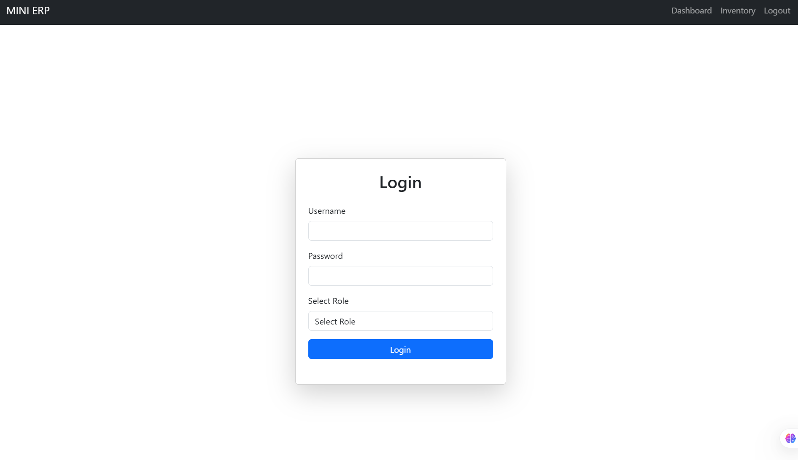
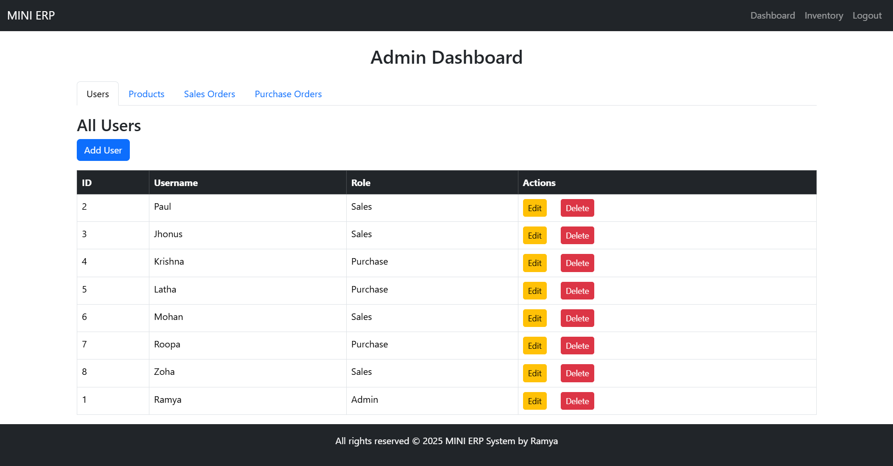

# Mini ERP System -frontend

A lightweight **Enterprise Resource Planning (ERP) system** built using **.NET 8 Web API**, **Angular 19**, and **PostgreSQL**. This system includes **JWT authentication, role management, sales and purchase modules**, and a user-friendly **admin dashboard**.

## Features
- **User Authentication** with JWT (Admin requires API key, others use username/password)
- **Role-Based Access Control** (Admin, Sales, Purchase)
- **Admin Dashboard** to manage users, products, and orders
- **Sales & Purchase Modules** with automated inventory updates
- **CRUD Operations** for users, products, and orders
- **Bootstrap-based UI** for a clean and responsive design

## Tech Stack
- **Backend:** .NET 8 Web API
- **Frontend:** Angular 19, Bootstrap
- **Database:** PostgreSQL
- **Authentication:** JWT Token & API Key (for admin)

## Installation
### Prerequisites
- Node.js & npm
- Angular CLI
- .NET 8 SDK
- PostgreSQL

### Setup Backend
1. Clone the repository:
   ```sh
   git clone https://github.com/Ramya-R74/incadea_project_assignment.git
   cd incadea_project_assignment/backend
   ```
2. Install dependencies:
   ```sh
   dotnet restore
   ```
3. Configure **PostgreSQL** connection in `appsettings.json`.
4. Run database migrations:
   ```sh
   dotnet ef database update
   ```
5. Start the backend:
   ```sh
   dotnet run
   ```

### Setup Frontend
1. Navigate to the frontend directory:
   ```sh
   cd ../frontend
   ```
2. Install dependencies:
   ```sh
   npm install
   ```
3. Run the application:
   ```sh
   ng serve
   ```

## Usage
1. **Admin Login** requires an API key.
2. **Users with Sales or Purchase roles** can log in with their credentials.
3. Admin can **manage users, products, sales orders, and purchase orders**.

## API Endpoints
- `POST /api/auth/login` → User login
- `POST /api/auth/admin-login` → Admin login with API key
- `GET /api/users` → Fetch all users (Admin only)
- `POST /api/users` → Add a new user (Admin only)
- `PUT /api/users/{id}` → Update user details (Admin only)
- `DELETE /api/users/{id}` → Remove a user (Admin only)
- `GET /api/products` → Get product list
- `POST /api/sales` → Create a sales order
- `POST /api/purchase` → Create a purchase order

## Screenshots
### Login Page


### Admin Dashboard


## Contributing
Feel free to fork the repo, create a feature branch, and submit a pull request!

## License
This project is **private** for now, but licensing details can be added later.

---
Made with ❤️ by **Ramya R**

